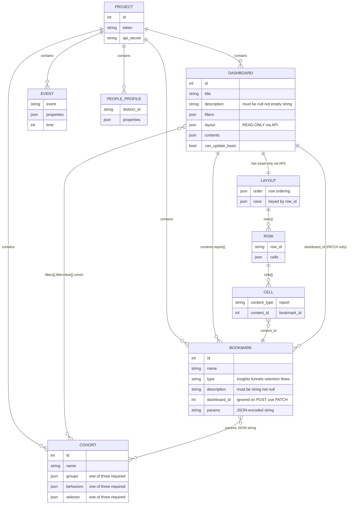
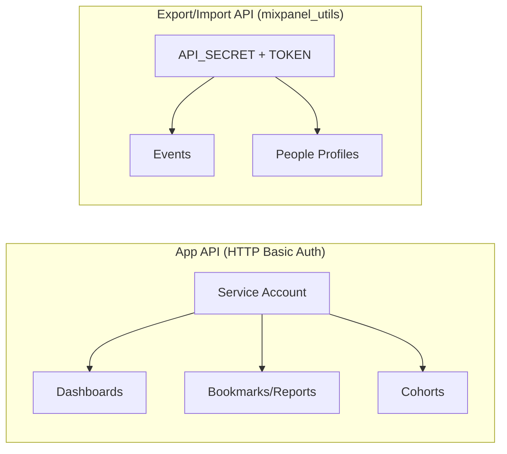

# Mixpanel Project Structure

## Authentication

## API Endpoints

| Resource | Method | Endpoint | Notes |
|----------|--------|----------|-------|
| Cohorts | POST | `/api/app/projects/{id}/cohorts` | Requires `groups`, `behaviors`, or `selector` |
| Dashboards | GET | `/api/app/projects/{id}/dashboards/{did}` | Includes layout (read-only) |
| Dashboards | POST | `/api/app/projects/{id}/dashboards` | `description` must be `null` |
| Dashboards | PATCH | `/api/app/projects/{id}/dashboards/{did}` | Can update filters, NOT layout |
| Reports | GET | `/api/app/projects/{id}/bookmarks` | Lists all bookmarks |
| Reports | POST | `/api/app/projects/{id}/bookmarks` | `params` = JSON string; ignores `dashboard_id` |
| Reports | PATCH | `/api/app/projects/{id}/bookmarks/{bid}` | Use this to set `dashboard_id` |

## API Quirks

- **Dashboard layout is read-only** — cannot be written via API (returns 500/403). Use Mixpanel's "Move to project" UI feature to preserve layouts.
- **`POST /bookmarks` ignores `dashboard_id`** — must `PATCH` the bookmark afterward to link it to a dashboard.
- **Cohort IDs in report params are doubly-encoded** — JSON string within JSON, so cohort IDs appear as `\"id\": 123` (escaped).
- **Dashboard `description`** must be `null` (not empty string) or the API returns 400.
- **Bookmark `description`** must be a string (not `null`) or the API returns 400.
- All endpoints retry on `429` responses, respecting the `Retry-After` header.
